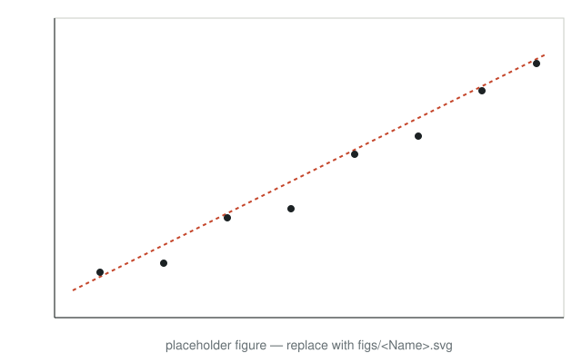

## The question the room wants answered before you answer it

<!--
This comment sits inside the first slide on purpose: anything between the YAML
header and the first `##` becomes a blank slide.
Template deck. Every slide below demonstrates one layout from theme/deck.scss.
Replace the content, keep the patterns. One idea per slide, title as an assertion,
a ::: {.notes} block on every slide that tells the presenter what to do and say.
-->

::: {.notes}
The hook. Ask the room to commit: a show of hands, one sentence. Then advance to the payoff.
:::

## Two cases, one reveal

::: {.split .center-v}
::: {.prose}
**Case A earned more on the first component.** About [1.4 points]{.num .primary-t} a year.

**Case B earned more on the second.** The two components offset, leaving the totals [about equal]{.contrast-t}.
:::
```{=html}
<div class="stage" data-chart="stack-reveal" data-animate="once"></div>
```
:::

::: {.notes}
The stage builds in when the slide appears: the first component first, then the second. Let it finish before speaking.
:::

## What the literature measures, and what this adds

::: {.claims}
- **First strand.** What it did and what it could not see.
- **Second strand.** Where it stopped.
- **This talk.** The object we observe that they could not.
:::

## 1 · The first section as a claim {.divider .center}

## The gradient in one picture {#gradient}

::: {.split .wide-left}
::: {.figwrap}

:::
::: {.prose}
One sentence about what the figure shows.

::: {.stat}
[[]{.data key="specs.0.beta" d="3"}]{.k}
[unit, and the magnitude between two points the room can picture. The number is read from `L.DATA` at load.]{.l}
:::

[What is plotted, the sample, the source table or figure.]{.source}
:::
:::

::: {.notes}
Replace figs/example.svg with a converted figure: sh figs/convert_figs.sh <source-dir> <Name>.
:::

## A line the presenter can walk along

::: {.split}
::: {.prose}
Drag the handle. The card says what a unit at that position earns.

[Dots are stylised around the estimated line. The slope is the source's estimate.]{.source}
:::
```{=html}
<div class="stage" data-chart="line-handle"></div>
```
:::

::: {.notes}
Drag from left to right once, slowly, and stop at the two points named on the previous slide.
:::

## Adding controls removes most of the slope

::: {.split}
::: {.prose}
Controls are cumulative down the rows. The last row is statistically indistinguishable from zero.

[Coefficient on X with 95 percent intervals. Specification details.]{.source}
:::
```{=html}
<div class="stage" data-chart="ladder"></div>
```
:::

## Three numbers the room should leave with

::: {.stats}
::: {.stat}
[1.36 pp]{.k}
[a year, between the two cases]{.l}
:::
::: {.stat}
[[]{.data key="ladderSpan"}]{.k .f}
[the span those two cases sit apart]{.l}
:::
::: {.stat}
[≈ 0]{.k .c}
[the total-return gradient, statistically]{.l}
:::
:::

::: {.notes}
A stat-card slide breaks a run of prose-beside-figure layouts. Three numbers at most, each with the magnitude a listener can feel.
:::

## The one sentence: the return arrives in different forms, and where you can buy decides the form {.divider}

::: {.notes}
A single large assertion, no figure. Use once or twice in a spine, at a turn.
:::

## Two readings of the same fact

::: {.split .even .cols}
::: {.prose}
[Reading [one]{.actor-a-t}]{.colhead}

Two sentences on what it predicts.
:::
::: {.prose}
[Reading [two]{.actor-b-t}]{.colhead}

Two sentences on what it predicts instead.
:::
:::

::: {.prose}
[The test that separates them: what we look at next.]{.q}
:::

## Conclusion

::: {.claims}
- The first finding, with its magnitude.
- The second, and why it reverses the obvious reading.
- What it implies, in one sentence.
:::

## Closing claim, the sentence they should leave with

**Thank you.**

[Name]{.source}
[Affiliation]{.source}
[email]{.source}

## Appendix {.divider .center visibility="uncounted"}

## A side room: the robustness a questioner will ask about {visibility="uncounted"}

::: {.figwrap .pair}


:::

[**Left:** what. **Right:** what. Source. [Back to the talk](#gradient).]{.figcap}

## References {visibility="uncounted"}

::: {#refs}
:::
